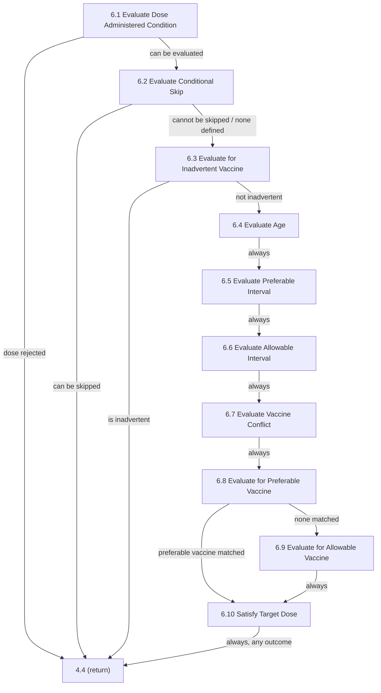

# Loop: Chapter 6 Dose Evaluation Chain

> **Review status:** draft. Transitions re-packaged from already-verified step packages (see `transitions.yaml`'s `source` fields).

## Source

Logic Specification for ACIP Recommendations v4.6, pages 45-69 (Chapter 6). Table 6-1, Figure 6-1. See [chapter-06-index.md](../../steps/chapter-06-index.md) for the full chapter overview and its own summary of this same chain.

## Iteration unit

**One target dose paired with one administered antigen record (AAR)** - this whole chain runs once per pairing; the loop that supplies successive pairings is the outer loop, [chapter-6-to-7-evaluate-and-forecast](../chapter-6-to-7-evaluate-and-forecast/index.md) (4.4).

## Entry point

6.1, entered from 4.4 with the current target dose and AAR already selected.

## Exit condition

Every path through this chain ends by returning to **4.4** - either early (6.1/6.2/6.3 rejecting the dose outright) or via 6.10, which *always* returns to 4.4 regardless of whether Table 6-31 found the target dose satisfied, extraneous, or not satisfied (verified: none of 6.10's six `LogicOutcome`s call `setNextLogicStepType` - the default set before evaluation is what actually runs, every time). 6.5 through 6.9 never exit early; a failed interval, conflict, or vaccine-type check is recorded on the target dose's `statusCause` field and only acted on at 6.10.

## State affected

Per step, an `Evaluation` outcome (status + reason) or a `statusCause` annotation is set on the current target dose; 6.10 reads all of the accumulated evidence and sets the target dose's final evaluation status.

## Where it applies

[6.1](../../steps/06-01-evaluate-dose-administered-condition/index.md) · [6.2](../../steps/06-02-evaluate-conditional-skip/index.md) · [6.3](../../steps/06-03-evaluate-for-inadvertent-vaccine/index.md) · [6.4](../../steps/06-04-evaluate-age/index.md) · [6.5](../../steps/06-05-evaluate-preferable-interval/index.md) · [6.6](../../steps/06-06-evaluate-allowable-interval/index.md) · [6.7](../../steps/06-07-evaluate-vaccine-conflict/index.md) · [6.8](../../steps/06-08-evaluate-for-preferable-vaccine/index.md) · [6.9](../../steps/06-09-evaluate-for-allowable-vaccine/index.md) · [6.10](../../steps/06-10-satisfy-target-dose/index.md).

## Open questions

None new for the control flow itself. Several *rule-level* gaps exist within individual steps of this chain (6.1's unimplemented lot-expiration rule, 6.2's hardcoded-false "Completed Series" condition, 6.5's wrong evaluation-reason bug, 6.8's hardcoded trade-name match) - these are documented, not fixed, in each step's own Review Findings and in [chapter-06-index.md](../../steps/chapter-06-index.md)'s summary; none of them change the control-flow edges shown above.
