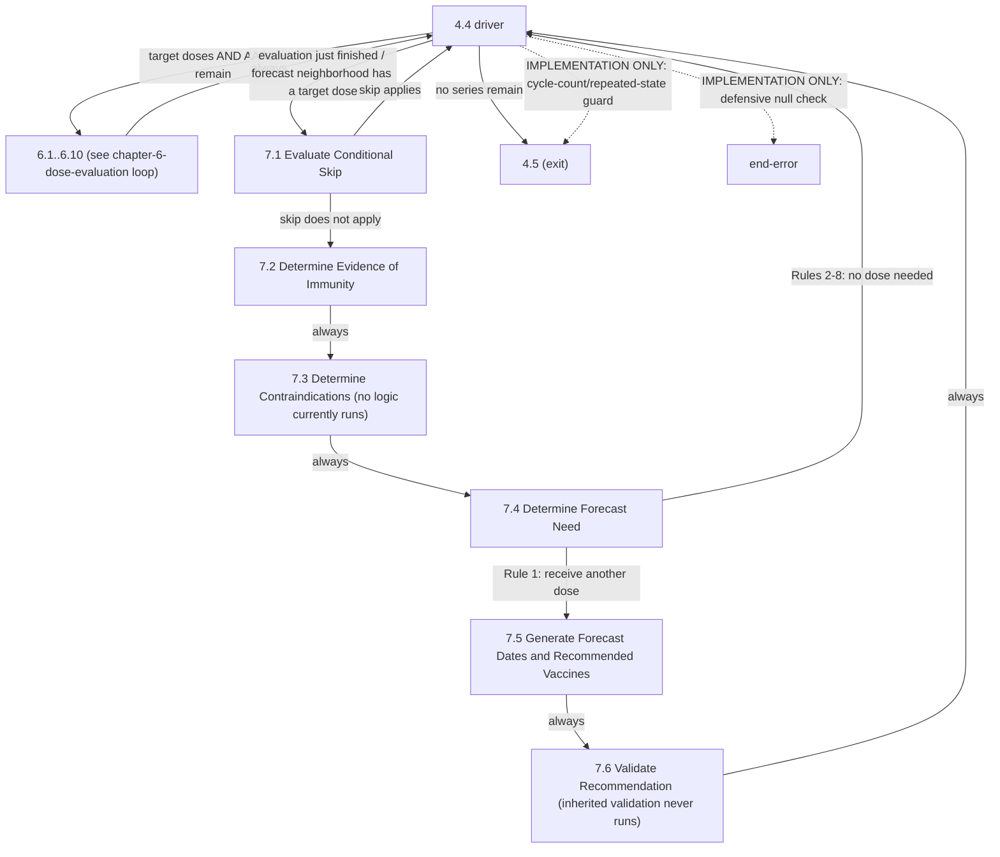

# Loop: Evaluate and Forecast All Patient Series (Chapters 6-7)

> **Review status:** draft. Transitions re-packaged from already-verified step packages (see `transitions.yaml`'s `source` fields).

## Source

Logic Specification for ACIP Recommendations v4.6, pages 35-37 (section 4.4, Figures 4-5, 4-6). See [4.4's step package](../../steps/04-04-evaluate-and-forecast-all-relevant-patient-series/index.md) for the full detail, and [chapter-06-index.md](../../steps/chapter-06-index.md)/[chapter-07-index.md](../../steps/chapter-07-index.md) for their respective chains.

## Iteration unit

**One target dose paired with one administered antigen record (AAR)**, for one patient series. 4.4 walks the current patient series' target-dose list against its AAR list together, advancing one or the other each cycle depending on the evaluation outcome from Chapter 6.

## Entry point

4.4, entered from [4.3](../../steps/04-03-create-relevant-patient-series/index.md)/[5.1](../../steps/05-01-select-relevant-patient-series/index.md) once relevant patient series exist for the current antigen.

## Exit condition

Two ways a single series' evaluate-and-forecast cycle ends: target doses are exhausted (any remaining AARs become `EXTRANEOUS`), or AARs are exhausted (evaluation ends; forecasting, Chapter 7, begins on whichever target dose evaluation stopped at). The whole loop (across all relevant patient series for the current antigen) ends when no series remain, exiting to **4.5**. **[IMPLEMENTATION - no spec basis]** Two additional safety-net exits also reach 4.5: a total-cycle-count guard (1000) and a repeated-loop-state guard (200), both purely defensive against a runaway loop, not specification requirements - see 4.4's own Review Findings for the exact thresholds and whether they're arbitrary.

## State affected

Per pairing: an `Evaluation` (status + reason) on the target dose (Chapter 6) or a `Forecast` (dates + reason) on the patient series (Chapter 7). Across pairings within one series: the target-dose/AAR position pointers advance; a recurring dose (e.g. yearly flu) can insert an additional target dose into the list mid-loop.

## Where it applies

[4.4](../../steps/04-04-evaluate-and-forecast-all-relevant-patient-series/index.md), the [chapter-6-dose-evaluation loop](../chapter-6-dose-evaluation/index.md) it delegates to, and Chapter 7's chain: [7.1](../../steps/07-01-evaluate-conditional-skip/index.md) · [7.2](../../steps/07-02-determine-evidence-of-immunity/index.md) · [7.3](../../steps/07-03-determine-contraindications/index.md) · [7.4](../../steps/07-04-determine-forecast-need/index.md) · [7.5](../../steps/07-05-generate-forecast-dates-and-recommended-vaccines/index.md) · [7.6](../../steps/07-06-validate-recommendation/index.md).

## Open questions

- The two loop-guard escapes in 4.4 have no specification basis - already flagged in 4.4's own Review Findings as worth confirming with a domain expert whether the 1000/200 thresholds are principled or arbitrary. Not fixed here, per standing instruction.
- 7.3 evaluates no decision logic at all (see its Review Findings) and 7.6 never runs its inherited validation (see its Review Findings) - both already documented as significant implementation gaps in Chapter 7's own materials; this diagram shows the control flow as it ACTUALLY runs today (7.3 and 7.6 both pass straight through), not as the specification describes it.
