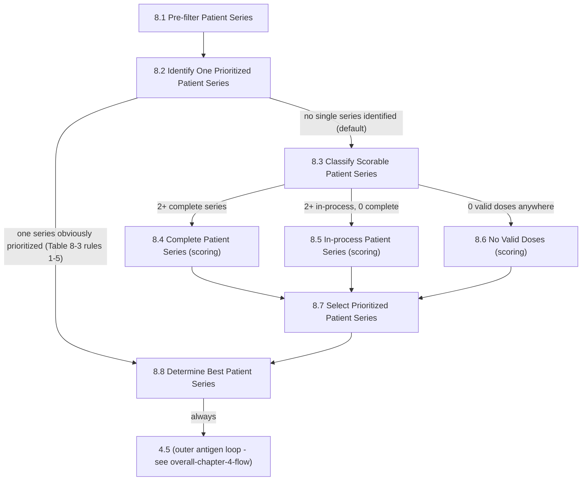

# Loop: Chapter 8 Series Selection

> **Review status:** draft. Transitions re-packaged from already-verified step packages (see `transitions.yaml`'s `source` fields).

## Source

Logic Specification for ACIP Recommendations v4.6, pages 84-92 (Chapter 8). Table 8-1, Figures 8-1 (whole chapter), 8-2 (the 8.1-8.7 per-series-group flow specifically - chapter-level content, not owned by any single numbered subsection despite similar titles to 8.2/8.7; see [chapter-08-index.md](../../steps/chapter-08-index.md)'s Source note). See that same chapter index for the full branch analysis this diagram formalizes.

## Iteration unit

**One series group**, within one antigen (8.1 through 8.8 runs once per series group; the antigen-level repetition is the outer loop - see [overall-chapter-4-flow](../overall-chapter-4-flow/index.md)).

## Entry point

8.1, entered from **4.5** (the antigen-loop driver) once relevant/scorable patient series exist for the current antigen's series groups.

## Exit condition

Every path ends at **8.8**, which always exits to **4.5** - not back into Chapter 8 - after evaluating Table 8-14 for every prioritized series found. 4.5 then either advances to the next antigen (looping back to 8.1) or, once all antigens are done, proceeds to 4.6.

## State affected

8.2 identifies whether a series group already has one obvious answer (skipping scoring). If not, 8.3 classifies which of three scoring paths applies (2+ complete, 2+ in-process with none complete, or no valid doses anywhere), 8.4/8.5/8.6 award points to each candidate series under that classification, 8.7 picks the single highest scorer, and 8.8 confirms it as the group's best series (or not, per Table 8-14).

## Where it applies

[8.1](../../steps/08-01-pre-filter-patient-series/index.md) · [8.2](../../steps/08-02-identify-one-prioritized-patient-series/index.md) · [8.3](../../steps/08-03-classify-scorable-patient-series/index.md) · [8.4](../../steps/08-04-complete-patient-series/index.md) · [8.5](../../steps/08-05-in-process-patient-series/index.md) · [8.6](../../steps/08-06-no-valid-doses/index.md) · [8.7](../../steps/08-07-select-prioritized-patient-series/index.md) · [8.8](../../steps/08-08-determine-best-patient-series/index.md).

## Open questions

None new for the control flow itself - the branch structure above was independently re-verified against every cited class's `setLogicOutcome`/`process()` while building [chapter-08-index.md](../../steps/chapter-08-index.md). Several *rule-level* bugs exist within the 8.4-8.6 scoring family (tie-handling in 8.4, `Date` reference-equality in 8.5/8.6, an always-true condition in 8.6) - documented, not fixed, in each step's own Review Findings; none of them change the branch edges shown above.
