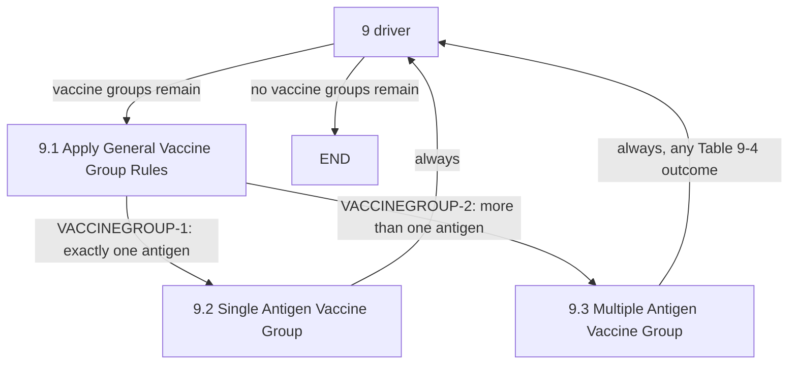

# Loop: Chapter 9 Vaccine Group Evaluation

> **Review status:** draft. Transitions re-packaged from already-verified step packages (see `transitions.yaml`'s `source` fields).

## Source

Logic Specification for ACIP Recommendations v4.6, pages 93-97 (Chapter 9). Table 9-1, Table 9-2, Table 9-4, Figure 9-1. See [chapter-09-index.md](../../steps/chapter-09-index.md) for the full chapter overview.

## Iteration unit

**One vaccine group.** This is the outermost driver of the entire engine run - it is not nested inside any other loop in this document set. Every antigen belonging to a vaccine group has already been through the full [overall-chapter-4-flow](../overall-chapter-4-flow/index.md) loop (which itself contains the [relevant-patient-series-selection](../relevant-patient-series-selection/index.md), [chapter-6-dose-evaluation](../chapter-6-dose-evaluation/index.md), and [chapter-6-to-7-evaluate-and-forecast](../chapter-6-to-7-evaluate-and-forecast/index.md) loops, plus [chapter-8-series-selection](../chapter-8-series-selection/index.md)) before 9.1 ever runs for that group.

## Entry point

"9" (`IdentifyAndEvaluateVaccineGroup`), entered once per engine run as the loop driver over all configured vaccine groups.

## Exit condition

When no vaccine groups remain to process, the driver sets `LogicStepType.END` and the run terminates. This is the only loop in this document set whose exit is the actual end of processing rather than a handoff to another loop.

## State affected

9.1 applies group-wide rules (Table 9-2) and classifies the group as single- or multi-antigen. 9.2 handles the single-antigen case (its one antigen's own forecast/evaluation, already produced by Chapter 4, stands as the group's result). 9.3 applies Table 9-4's cross-antigen combination rules for multi-antigen groups (e.g., combination vaccines) before returning to the driver.

## Where it applies

[9.1](../../steps/09-01-apply-general-vaccine-group-rules/index.md) · [9.2](../../steps/09-02-single-antigen-vaccine-group/index.md) · [9.3](../../steps/09-03-multiple-antigen-vaccine-group/index.md).

## Open questions

None new for the control flow itself - independently re-verified against `IdentifyAndEvaluateVaccineGroup`, `ApplyGeneralVaccineGroupRules$LT`, `SingleAntigenVaccineGroup`, and `MultipleAntigenVaccineGroup`. Chapter 9 does have an already-documented traceability gap (9.1 implements only 2 of Table 9-2's 12 rules) noted in [chapter-09-index.md](../../steps/chapter-09-index.md) - per that same index, nothing in this chapter approaches the severity of Chapter 7's missing-contraindication-logic finding. Documented, not fixed, per standing instruction.
