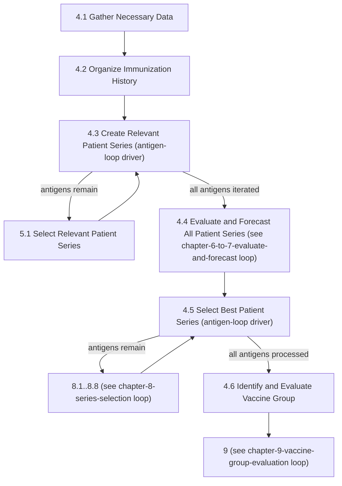

# Loop: Overall Chapter 4 Processing Flow

> **Review status:** draft. Transitions re-packaged from already-verified step packages (see `transitions.yaml`'s `source` fields) - not re-derived from code in this pass.

## Source

Logic Specification for ACIP Recommendations v4.6, page 30 (Table 4-1, Figure 4-1) and page 31 (Figure 4-2). See [`concepts/overall-processing-model.md`](../../concepts/overall-processing-model.md) for the full prose account this diagram formalizes, and [chapter-04-index.md](../../steps/chapter-04-index.md) for the chapter overview.

## Iteration unit

**One antigen.** Chapter 4's backbone (4.1 → 4.2 → 4.3 → 4.4 → 4.5 → 4.6) runs its data-gathering steps (4.1, 4.2) exactly once per forecast request, but 4.3 and 4.5 are each loop drivers that repeat their downstream work (5.1, and 8.1-8.8 respectively) once for every antigen in the patient's antigen list.

## Entry point

4.1, driven by whatever adapts the caller's input into a `ForecastInput` (see [4.1](../../steps/04-01-gather-necessary-data/index.md)).

## Exit condition

This loop itself doesn't terminate the engine - it hands off to Chapter 9 at 4.6, which is a separate loop (see [chapter-9-vaccine-group-evaluation](../chapter-9-vaccine-group-evaluation/index.md)) that ends the whole run. Within this loop, 4.3's and 4.5's antigen iterations each end when `dataModel`'s antigen-selected list is exhausted (verified in `CreateRelevantPatientSeries#process` and `SelectBestPatientSeries#process` respectively).

## State affected

Per antigen: 4.3/5.1 builds the antigen's relevant `PatientSeries` list; 4.4 (see the chapter-6-to-7-evaluate-and-forecast loop) evaluates and forecasts each of those series; 4.5/Chapter 8 selects one best series per series group for that antigen. What persists across antigens: the growing list of best patient series across all antigens, which 4.6/Chapter 9 later consolidates into vaccine-group forecasts.

## Where it applies

[4.1](../../steps/04-01-gather-necessary-data/index.md) · [4.2](../../steps/04-02-organize-immunization-history/index.md) · [4.3](../../steps/04-03-create-relevant-patient-series/index.md) · [5.1](../../steps/05-01-select-relevant-patient-series/index.md) · [4.4](../../steps/04-04-evaluate-and-forecast-all-relevant-patient-series/index.md) · [4.5](../../steps/04-05-select-best-patient-series/index.md) · [4.6](../../steps/04-06-identify-and-evaluate-vaccine-group/index.md).

## Open questions

None new - this diagram only re-packages transitions already verified while building the step packages and `concepts/overall-processing-model.md`.
