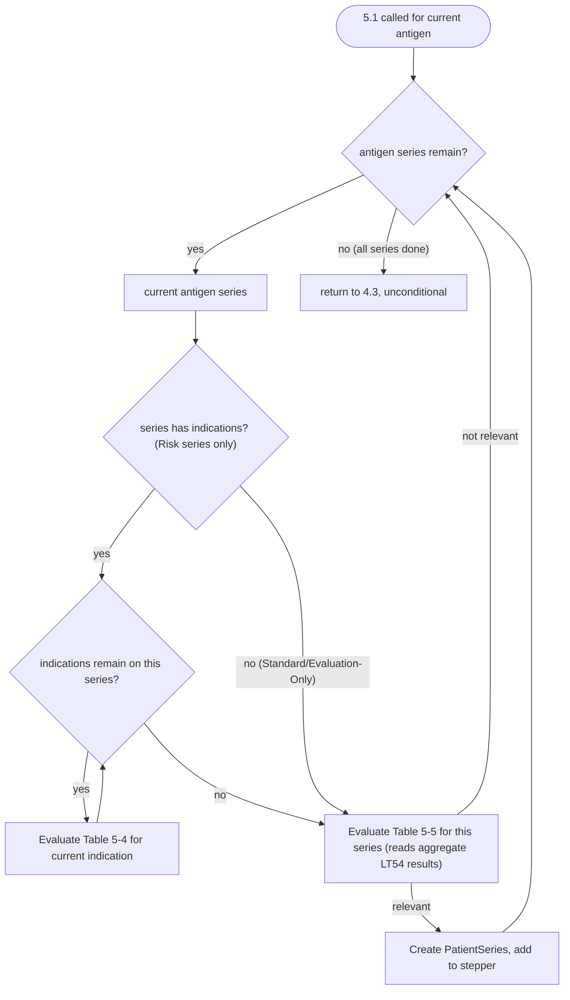

# Loop: Relevant Patient Series Selection

> **Review status:** draft.

## Source

Logic Specification for ACIP Recommendations v4.6, pages 41-44 (section 5.1). Table 5-2 through 5-5, Figures 5-1, 5-2, 5-3. See [5.1's step package](../../steps/05-01-select-relevant-patient-series/index.md) for the full spec/implementation detail this diagram formalizes.

## A note on what kind of loop this is

**This is different in kind from the other five loops in this directory.** The other five are step-to-step transitions - one `LogicStep` returning a different `LogicStepType` to run next, verified via `setNextLogicStepType`. This loop is internal to a single call of 5.1's `process()` method: it never leaves the step, and 5.1's own external transition is a single unconditional edge back to 4.3 regardless of how many antigen series or indications it iterated. The plan calls this out separately from the overall Chapter 4 flow because it's a genuinely distinct piece of iteration logic, not because it changes the engine's step sequence - see `transitions.yaml`'s `internal_iteration` section for the mechanics, verified directly against `SelectRelevantPatientSeries.java`'s two nested `for` loops.

## Iteration unit

Two nested units: **one antigen series** (outer), and within it, **one indication defined on that series** (inner) - only relevant for antigen series whose Series Type is "Risk"; Standard/Evaluation-Only series have no indications to iterate and pass straight to the Table 5-5 check.

## Entry point

Called once per antigen from [4.3](../../steps/04-03-create-relevant-patient-series/index.md) (the antigen loop - see [overall-chapter-4-flow](../overall-chapter-4-flow/index.md)); internally, begins by fetching that antigen's `AntigenSeriesList` from Supporting Data.

## Exit condition

Outer loop: the antigen series list is exhausted. Inner loop (per series): that series' indication list is exhausted, after which Table 5-5 evaluates once for that series using the aggregated indication results. Once the outer loop finishes, 5.1 returns unconditionally to 4.3.

## State affected

Per indication: one Table 5-4 (`LT54`) decision, testing whether the indication currently applies to the patient (age window, active observations). Per antigen series: one Table 5-5 (`LT55`) decision, combining gender/series-type/indication-applicability into a relevant/not-relevant verdict; a relevant series becomes a new `PatientSeries` added to `dataModel.getPatientSeriesStepper()`, which is what 4.4 later evaluates and forecasts against. Nothing about the outer 4.3 antigen loop is affected by how many series/indications were processed here.

## Where it applies

[5.1](../../steps/05-01-select-relevant-patient-series/index.md), the target of [4.3](../../steps/04-03-create-relevant-patient-series/index.md)'s antigen loop (see [overall-chapter-4-flow](../overall-chapter-4-flow/index.md)).

## Open questions

None new - the nested-loop structure was confirmed directly against `SelectRelevantPatientSeries.java` for this pass; no ambiguity found in what iterates over what.
